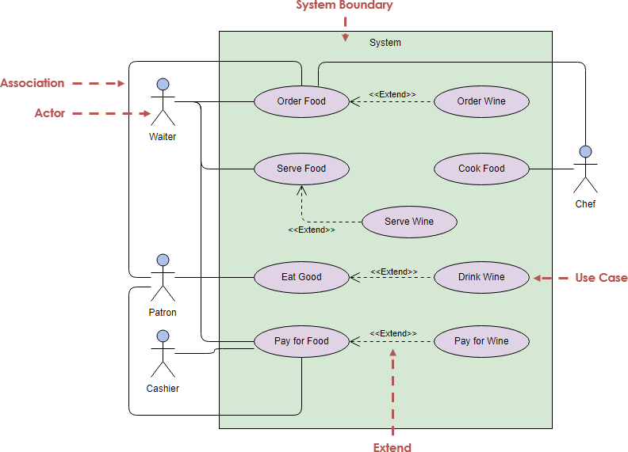

# UML Diagram
- Unified Modeling Language
- Tow types of UML
## 1) Structural - It represents the structure of your codebase

    i) Class Diagram (imp for interview)

    ii) Package Diagram

    iii) Object Diagram

    iv) component Diagram
## 2) Behavioural -  Method/ Behaviour of your codebase

    i) Usecase Diagram

    ii) Activity Diagram

    iii) Sequence Diagram

## UseCase Diagram
- diffrent features/functionality implemented in our codebase
- Who are the users of these codebase

### 5 Keywords
1) System Boundry - Represent scope of our system.
2) UseCase - Functionality/Behaviour, represented in oval shape
3) Actor - Users of System, nouns and represent usint stick diagram
4) Includes
    - **Schedule Interview** *includes* **Upload Resume*
    - **Place Order** *includes* **Add Address*
5) Extends - When one has multiple veriants
    - **Login** *extends* **Login via Google*
    - **Login** *extends* **Login via Email*
    - **Login** *extends* **Login via Instagram*

## Class Diagram
- Structural UML
- Represent diffent entitties of codebase like

    i) class

    ii) interface

    iii) Abstract class

    iv) enum

    ### and relationship btw these entities

    i) inheritance

    ii) implementing interface

    iii) one class has another class as attribute 

- Class Representation

- Interface Representation have << {interface_name}  >>
- Note that static attributes and method will have underline
- Abstract class exactly same like class just class name is in italic
- enum represented as comma separated values in box

### How to represent relationship between entities
1) **Inheritance** - Is-A, like Dog Is A Animal(class/interface)
2) **Association**  
    A general relationship between two independent classes.  
    **Example:** `Teacher ↔ Student` — both exist separately.

    **Aggregation (◻︎ or ◇)**  
    A weak whole–part relationship. The part can exist independently of the whole.  
    **Example:** `Department ◇ Professor` — professors can exist if the department is removed.

    **Composition (◆)**  
    A strong whole–part relationship. The part’s life is tied to the whole. If the whole is destroyed, so are the parts.  
    **Example:** `House ◆ Room` — rooms don’t exist without the house.

    ---

    **Quick table**

    | Type | Symbol | Lifetime |
    |---:|:---:|:---|
    | Association | — / ↔ | Independent |
    | Aggregation | ◇ | Part independent |
    | Composition | ◆ | Part dependent |